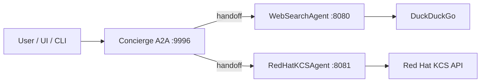

# Building a Research Concierge: Web Search, Red Hat KCS, and Agent-to-Agent Protocol

Research assistants often need two very different kinds of truth: the open web, where answers are broad and fast-moving, and vendor-official knowledge bases, where support articles and product-specific guidance live behind authenticated APIs. This project combines both behind a single orchestrator, uses **DeepSeek** for reasoning, and exposes everything through **Agent-to-Agent (A2A)** so components can run as separate services and be composed or replaced independently.

---

## What the application does

At a high level, users ask natural-language questions. A **concierge** agent decides whether to consult:

1. **General web search** — DuckDuckGo-backed search, synthesized into an answer with URLs.
2. **Red Hat official knowledge** — search against Red Hat’s **KCS** (Knowledge-Centered Support) catalog via the Access Red Hat **V2 search API**, again synthesized with citations.

Routing is **topic-aware**: questions that are primarily about Red Hat (RHEL, OpenShift, Satellite, subscriptions, support cases, and similar) should prefer the KCS path first; everything else should prefer the open web first. The second specialist is available when the first pass is not enough.

---

## Why multi-agent and A2A?

Monoliths are easy to ship once and painful to scale or swap. Here, each capability is a **small HTTP service** that speaks the A2A protocol (via the `a2a-sdk` stack and Starlette/Uvicorn for the leaf agents, and BeeAI’s A2A server for the concierge). Benefits:

- **Isolation** — Web search never needs Red Hat credentials; the KCS agent never needs to embed a general crawler.
- **Independent deployment** — Scale or restart one backend without touching the others.
- **Clear contracts** — Each agent advertises an **agent card** (name, description, skills). The orchestrator discovers behavior at connection time.
- **Composability** — The same leaf agents could be wired into a different orchestrator or UI without rewriting their core logic.

---

## Architecture in three layers

### 1. Leaf agents (specialists)

**Web search (`web-search-agent-deepseek.py`)**  
Uses the OpenAI-compatible DeepSeek API with **function calling**. The model invokes a `web_search` tool implemented with `ddgs` (DuckDuckGo). Queries can be **rewritten** first (LangChain + `ChatDeepSeek`) to improve recall. Results are returned as JSON to the model, which then produces a final answer. The process is wrapped in an A2A server so remote clients see a single “agent” endpoint.

**Red Hat KCS (`redhat-kcs-agent-deepseek.py`)**  
Same pattern: DeepSeek + tool calling, but the tool calls Red Hat’s **KCS V2** POST endpoint (`search_v2_kcs` in `kcsv2.py`). Authentication uses an **offline token** exchanged for a short-lived bearer token (`get_red_hat_access_token`). API responses are normalized into compact JSON (titles, URLs, summaries, products) so the model can cite official articles without dumping raw HTML.

### 2. Orchestrator (concierge)

**`web_util.build_concierge`** constructs a BeeAI **`RequirementAgent`** backed by **`DeepseekChatModel`**. It does not embed search logic; it connects to the two leaf agents as **`A2AAgent`** instances at configurable host/port pairs and exposes them as **`HandoffTool`** targets.

The concierge also gets:

- A **`ThinkTool`** step, forced early in the run, to encourage deliberate routing.
- **Conditional requirements** so a final answer is only produced after a handoff has occurred—forcing the model to actually delegate to a specialist rather than hallucinate from memory.
- **Custom instructions** and **tool descriptions** that spell out Red Hat–first vs. web-first priority.

Handoff tool descriptions augment each sub-agent’s card with explicit **PRIORITY** hints so the model’s routing aligns with product intent.

### 3. Entry points and clients

**`a2a_web_server.py`** loads environment variables, builds the concierge, and serves it with BeeAI’s **`A2AServer`** (JSON-RPC over HTTP). Defaults: web search on port `8080`, Red Hat KCS on `8081`, concierge on `9996` (all overridable via flags or env vars such as `WEB_SEARCH_AGENT_PORT`, `REDHAT_KCS_AGENT_PORT`, `Concierge_AGENT_PORT`).

**`a2a_web_client.py`** and **`web_UI.py`** (Flask) are examples of clients that send user prompts to the concierge—useful for demos and manual testing.

---

## End-to-end flow

1. User submits a prompt to the concierge (e.g. port `9996`).
2. Concierge runs **Think**, then chooses **handoff** to `WebSearchAgent-DeepSeek` or `RedHatKCSAgent-DeepSeek` based on instructions and tool text.
3. The selected leaf agent runs its tool loop (web or KCS), returns text to the concierge.
4. Concierge synthesizes a final answer, ideally naming which agent supplied the material and preserving URLs.

---

## Running it (typical layout)

You need API keys in the environment (e.g. **`DEEPSEEK_API_KEY`**; for KCS, **`REDHAT_OFFLINE_TOKEN`**). Then start three processes:

1. `web-search-agent-deepseek.py` — e.g. port **8080**
2. `redhat-kcs-agent-deepseek.py` — e.g. port **8081**
3. `a2a_web_server.py` — concierge on **9996**, pointing at the two ports above

A UI or client then targets the concierge port, not the leaf ports directly.

---

## Design tradeoffs

- **Routing is LLM-guided**, not a separate classifier. That keeps the stack simple but means edge cases (e.g. “Ansible” without “Red Hat”) depend on model judgment; tightening behavior can mean richer instructions or a lightweight pre-router later.
- **KCS vs. docs.redhat.com** — This stack targets **support/KCS-style** articles via the Access API. Product manuals on `docs.redhat.com` are a different surface if you need them later.
- **Operational surface** — Three long-running services plus keys are more moving parts than a single script; the tradeoff is clarity and replaceability of each piece.

---

## Demo (screenshots)

The following walkthrough matches the **shot list** in [`demo/README.md`](demo/README.md). Save PNG files under `demo/screenshots/` with these names so the figures below display in Git hosting or local Markdown preview.

**Runtime topology** (for orientation):

1. **Stack running** — three services: web search leaf, Red Hat KCS leaf, concierge orchestrator.

   

2. **Concierge discovers both specialists** — startup output listing `WebSearchAgent-DeepSeek` and `RedHatKCSAgent-DeepSeek`.

   

3. **General web path** — Flask chat UI (`web_UI.py`) with a non–Red Hat question; answer should emphasize open-web sources.

   

4. **Red Hat–first path** — same UI with a Red Hat product or support question; answer should emphasize KCS / Access Red Hat article links.

   

5. **CLI client** — `a2a_web_client.py` (or equivalent) sending a prompt to the concierge port.

   

6. **Optional: KCS leaf detail** — Red Hat agent log line showing query enhancement (no secrets in frame).

   

---

## Closing

This application is a concrete pattern for **specialist agents behind a policy-aware concierge**: open web for breadth, authenticated vendor search for depth, **A2A** for boundaries, and **DeepSeek** for both execution and routing. If you are building similar systems, the most portable ideas are the separation of leaf agents, the use of agent cards and handoffs for discovery, and explicit priority rules in the orchestrator’s instructions so behavior stays predictable as you add more backends.
